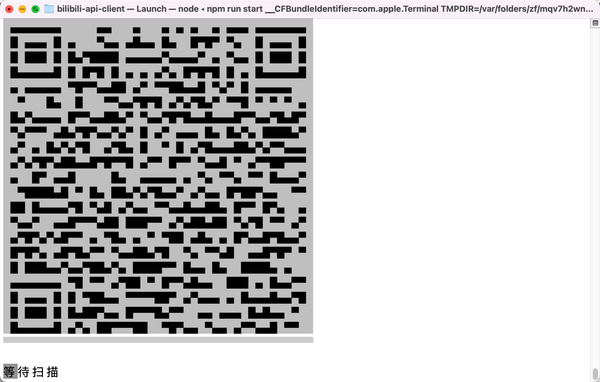

# Bilibili 视频下载工具

## 使用

需要 [node](https://nodejs.org/) >= 16

推荐使用 [pnpm](https://pnpm.io/zh/) 代替 npm

```sh
npm install
```

```sh
npm run start
```

控制台会出现二维码，使用哔哩哔哩手机APP扫码登陆。

随后输入BV号，即可下载视频。（已支持完整网址、多P下载、新番下载、直播下载）




## FFmpeg

默认会从 bin 文件夹查找 ffmpeg 的可执行文件，规则是 `ffmpeg_${platform}_${arch}${binExt}`，如果没有找到则直接使用命令 ffmpeg。

目前已自带 windows x64 和 macos arm64 版本。编译的参数是 `./configure --disable-encoders --disable-decoders --disable-filters --disable-devices --disable-bsfs --disable-hwaccels`，因为只是用来合并视频音频，所以不需要其他功能，精简了大小

## 港澳台新番

在根目录下创建 `.env` 文件，然后写：

```
API_PROXY_HOST=api.your-bilibili-proxy.com
```

程序会使用这个域名请求

## 测试视频

* 普通：https://www.bilibili.com/video/BV18q4y1x7PH
* 番剧：https://www.bilibili.com/bangumi/play/ep508406 https://www.bilibili.com/bangumi/play/ep511342
* 8k：https://www.bilibili.com/video/BV1yb4y1J7wR https://www.bilibili.com/video/BV1qM4y1w716 BV1iq4y1R7sd
* 多P：https://www.bilibili.com/video/BV1ia41187a9 BV1Hv4y1N7MU
* 直播 https://live.bilibili.com/21704811
* 港澳台新番 https://www.bilibili.com/bangumi/play/ss41492/

## 网页播放器（测试）

提供了一个页面可以直接看哔哩哔哩的视频，需要运行一个 node 服务，用来代理请求。

```sh
# 构建播放器前端
cd src/web-player
npm install
npm run build

# 运行服务
cd ../..
npm install
npm run server-debug

```